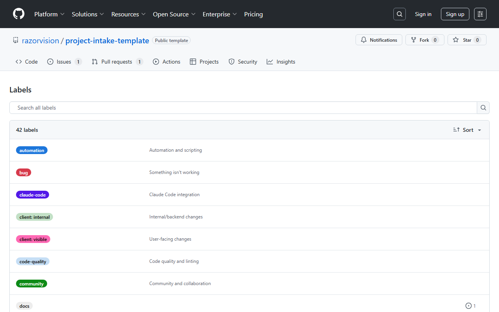

# Documentation Assets

This folder contains images, screenshots, and other media used in documentation.

## Structure

```
assets/
├── screenshots/     # UI and terminal screenshots
│   ├── github-labels.png
│   ├── project-board.png
│   ├── claude-code-mcp.png
│   └── ...
└── README.md        # This file
```

## Screenshot Guidelines

### Naming Convention

Use kebab-case with descriptive names:
- `github-labels-after-setup.png`
- `project-board-kanban-view.png`
- `claude-code-slash-command.png`
- `terminal-mcp-servers.png`

### Recommended Dimensions

| Type | Width | Notes |
|------|-------|-------|
| Full screen | 1200-1400px | For dashboards, project boards |
| Focused area | 600-800px | For specific UI elements |
| Terminal | 800px | For CLI output |
| GIF | 800px max | Keep file size under 5MB |

### Optimization

Before committing, optimize images:

```bash
# Using ImageOptim (Mac)
imageoptim docs/assets/screenshots/*.png

# Using pngquant (cross-platform)
pngquant --quality=65-80 docs/assets/screenshots/*.png
```

### Embedding in Markdown

```markdown
# Relative path from doc location


# With alt text for accessibility


# Clickable image linking to full size
[](../assets/screenshots/project-board.png)
```

## Current Screenshots

### GitHub Repository

| Screenshot | Description | Used In |
|------------|-------------|---------|
| `github-repo-main.png` | Repository main page | README.md |
| `github-labels.png` | Labels page after setup script | README.md, GITHUB_LABELS.md |
| `github-issue-templates.png` | Issue template chooser | TEMPLATE_USAGE.md |
| `github-pr-template.png` | PR creation page | BRANCH_STRATEGY.md |
| `github-pull-requests.png` | Pull requests list view | BRANCH_STRATEGY.md |
| `github-actions.png` | GitHub Actions workflows tab | CI_MONITORING_GUIDE.md |

### OAuth Documentation

| Screenshot | Description | Used In |
|------------|-------------|---------|
| `github-oauth-docs.png` | GitHub OAuth app creation docs | AUTH_IMPLEMENTATION_GUIDE.md |
| `google-oauth-docs.png` | Google OAuth documentation | AUTH_IMPLEMENTATION_GUIDE.md |

### Database Providers

| Screenshot | Description | Used In |
|------------|-------------|---------|
| `supabase-landing.png` | Supabase landing page | DATABASE_SETUP.md |
| `neon-landing.png` | Neon database landing page | DATABASE_SETUP.md |
| `planetscale-landing.png` | PlanetScale landing page | DATABASE_SETUP.md |

### Deployment & Monitoring

| Screenshot | Description | Used In |
|------------|-------------|---------|
| `vercel-landing.png` | Vercel dashboard/login | DOCKER_GUIDE.md |
| `sentry-landing.png` | Sentry landing page | ENV_VARIABLES.md |

### Documentation Sites

| Screenshot | Description | Used In |
|------------|-------------|---------|
| `nextauth-docs.png` | NextAuth.js documentation | AUTH_IMPLEMENTATION_GUIDE.md |
| `prisma-docs.png` | Prisma documentation | DATABASE_SETUP.md |

## Video Assets

| File | Description |
|------|-------------|
| `VIDEO_SCRIPT.md` | Complete 8-10 minute walkthrough script with recording tips |

## Creating Screenshots

### Automated (Playwright Script)

```bash
# Run the screenshot capture script
node scripts/capture-screenshots.cjs

# This captures GitHub pages automatically
# Edit the script to add more screenshots
```

### Manual

1. Capture with your preferred tool
2. Crop to relevant area
3. Optimize file size
4. Save with descriptive name
5. Update this README if adding new screenshots
