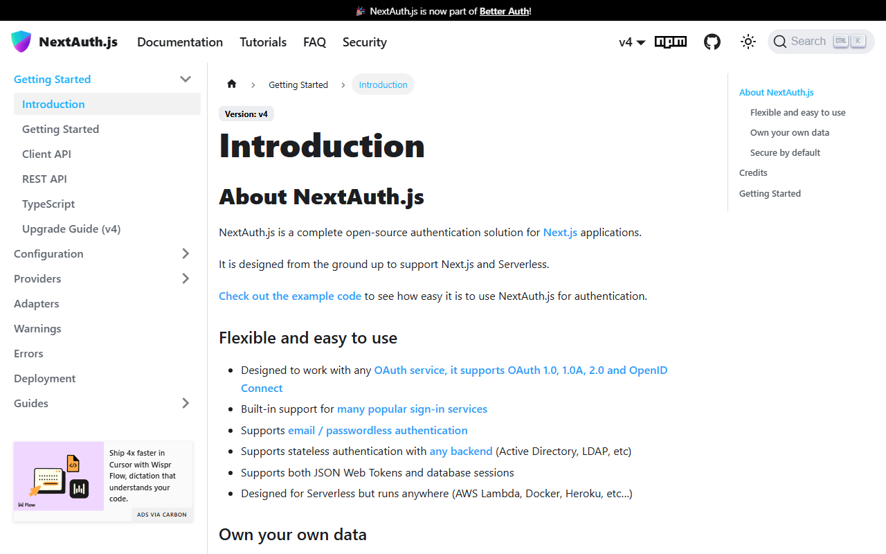

# Authentication Implementation Guide

Step-by-step guide for implementing authentication in web applications, with a focus on NextAuth.js but applicable patterns for other providers.

---

## TL;DR - 5 Minute Auth Setup

**Just want auth working quickly?** Here's the fastest path:

### 1. Install

```bash
npm install next-auth @auth/prisma-adapter
```

### 2. Set Environment Variables

```bash
# .env.local
AUTH_SECRET=run-this-command-openssl-rand-base64-32
NEXTAUTH_URL=http://localhost:3000

# Pick ONE provider to start:
GITHUB_CLIENT_ID=your-id
GITHUB_CLIENT_SECRET=your-secret
```

### 3. Create Auth Route

```typescript
// app/api/auth/[...nextauth]/route.ts
import NextAuth from 'next-auth'
import GitHub from 'next-auth/providers/github'

const handler = NextAuth({
  providers: [
    GitHub({
      clientId: process.env.GITHUB_CLIENT_ID!,
      clientSecret: process.env.GITHUB_CLIENT_SECRET!,
    }),
  ],
})

export { handler as GET, handler as POST }
```

### 4. Done!

Visit `http://localhost:3000/api/auth/signin` to test.

**Want more?** Read the full guide below.

---

## Which Auth Provider Should I Use?

```
                    START HERE
                        │
        ┌───────────────┼───────────────┐
        │               │               │
        ▼               ▼               ▼
   Need it       Using Next.js?    Enterprise
   FAST?              │            requirements?
        │        ┌────┴────┐            │
        ▼        ▼         ▼            ▼
     CLERK    Yes         No         AUTH0
   (5 min)     │           │       (compliance,
              ▼           ▼         SSO, SAML)
         NEXTAUTH    Consider:
         (free,      - Supabase Auth
         flexible)   - Firebase Auth
                     - Lucia
```

### Decision Matrix

| If you need... | Use | Why |
|---------------|-----|-----|
| Fastest setup, don't care about vendor lock-in | **Clerk** | Pre-built UI, 5-minute setup |
| Free, full control, Next.js app | **NextAuth.js** | Open source, flexible, great ecosystem |
| Already using Supabase | **Supabase Auth** | Integrated, row-level security |
| Already using Firebase | **Firebase Auth** | Integrated, good mobile support |
| Enterprise SSO, SAML, compliance | **Auth0** | Enterprise features, SOC2 ready |
| Non-Next.js Node app | **Lucia** | Framework agnostic, lightweight |

### Quick Environment Variables by Provider

<details>
<summary><strong>NextAuth.js</strong></summary>

```bash
AUTH_SECRET=generate-with-openssl-rand-base64-32
NEXTAUTH_URL=http://localhost:3000

# GitHub OAuth
GITHUB_CLIENT_ID=
GITHUB_CLIENT_SECRET=

# Google OAuth
GOOGLE_CLIENT_ID=
GOOGLE_CLIENT_SECRET=
```
</details>

<details>
<summary><strong>Clerk</strong></summary>

```bash
NEXT_PUBLIC_CLERK_PUBLISHABLE_KEY=pk_test_xxx
CLERK_SECRET_KEY=sk_test_xxx
NEXT_PUBLIC_CLERK_SIGN_IN_URL=/sign-in
NEXT_PUBLIC_CLERK_SIGN_UP_URL=/sign-up
NEXT_PUBLIC_CLERK_AFTER_SIGN_IN_URL=/dashboard
NEXT_PUBLIC_CLERK_AFTER_SIGN_UP_URL=/dashboard
```
</details>

<details>
<summary><strong>Auth0</strong></summary>

```bash
AUTH0_SECRET=generate-with-openssl-rand-hex-32
AUTH0_BASE_URL=http://localhost:3000
AUTH0_ISSUER_BASE_URL=https://YOUR_TENANT.auth0.com
AUTH0_CLIENT_ID=
AUTH0_CLIENT_SECRET=
```
</details>

<details>
<summary><strong>Supabase Auth</strong></summary>

```bash
NEXT_PUBLIC_SUPABASE_URL=https://xxx.supabase.co
NEXT_PUBLIC_SUPABASE_ANON_KEY=eyJxxx
SUPABASE_SERVICE_ROLE_KEY=eyJxxx
```
</details>

---

## Choosing an Auth Provider

| Provider | Best For | Complexity | Cost |
|----------|----------|------------|------|
| **NextAuth.js** | Next.js apps, flexibility | Medium | Free |
| **Clerk** | Quick setup, hosted UI | Low | Freemium |
| **Auth0** | Enterprise, compliance | Medium | Freemium |
| **Supabase Auth** | Supabase ecosystem | Low | Free tier |
| **Firebase Auth** | Firebase ecosystem | Low | Free tier |

## NextAuth.js Implementation

### 1. Installation

```bash
npm install next-auth
```

### 2. Environment Variables

Create `.env.local`:

```bash
# Required
NEXTAUTH_URL=http://localhost:3000
NEXTAUTH_SECRET=your-secret-key-here  # Generate: openssl rand -base64 32

# OAuth Providers (add as needed)
GITHUB_ID=your-github-oauth-app-id
GITHUB_SECRET=your-github-oauth-app-secret

GOOGLE_CLIENT_ID=your-google-client-id
GOOGLE_CLIENT_SECRET=your-google-client-secret

# Database (for session persistence)
DATABASE_URL=postgresql://...
```

### 3. API Route Setup

**App Router** (`app/api/auth/[...nextauth]/route.ts`):

```typescript
import NextAuth from 'next-auth'
import { authOptions } from '@/lib/auth'

const handler = NextAuth(authOptions)
export { handler as GET, handler as POST }
```

**Auth Configuration** (`lib/auth.ts`):

```typescript
import { NextAuthOptions } from 'next-auth'
import { PrismaAdapter } from '@auth/prisma-adapter'
import GitHubProvider from 'next-auth/providers/github'
import GoogleProvider from 'next-auth/providers/google'
import { prisma } from '@/lib/prisma'

export const authOptions: NextAuthOptions = {
  adapter: PrismaAdapter(prisma),
  providers: [
    GitHubProvider({
      clientId: process.env.GITHUB_ID!,
      clientSecret: process.env.GITHUB_SECRET!,
    }),
    GoogleProvider({
      clientId: process.env.GOOGLE_CLIENT_ID!,
      clientSecret: process.env.GOOGLE_CLIENT_SECRET!,
    }),
  ],
  session: {
    strategy: 'jwt', // or 'database' for server-side sessions
  },
  callbacks: {
    async session({ session, token }) {
      if (session.user && token.sub) {
        session.user.id = token.sub
      }
      return session
    },
    async jwt({ token, user }) {
      if (user) {
        token.id = user.id
      }
      return token
    },
  },
  pages: {
    signIn: '/auth/signin',  // Custom sign-in page
    error: '/auth/error',    // Error page
  },
}
```

### 4. Prisma Schema

Add NextAuth models to `prisma/schema.prisma`:

```prisma
model Account {
  id                String  @id @default(cuid())
  userId            String
  type              String
  provider          String
  providerAccountId String
  refresh_token     String? @db.Text
  access_token      String? @db.Text
  expires_at        Int?
  token_type        String?
  scope             String?
  id_token          String? @db.Text
  session_state     String?

  user User @relation(fields: [userId], references: [id], onDelete: Cascade)

  @@unique([provider, providerAccountId])
}

model Session {
  id           String   @id @default(cuid())
  sessionToken String   @unique
  userId       String
  expires      DateTime
  user         User     @relation(fields: [userId], references: [id], onDelete: Cascade)
}

model User {
  id            String    @id @default(cuid())
  name          String?
  email         String?   @unique
  emailVerified DateTime?
  image         String?
  accounts      Account[]
  sessions      Session[]
}

model VerificationToken {
  identifier String
  token      String   @unique
  expires    DateTime

  @@unique([identifier, token])
}
```

Push schema:

```bash
npx prisma db push
```

### 5. Session Provider

**App Router** (`app/providers.tsx`):

```typescript
'use client'

import { SessionProvider } from 'next-auth/react'

export function Providers({ children }: { children: React.ReactNode }) {
  return <SessionProvider>{children}</SessionProvider>
}
```

**Root Layout** (`app/layout.tsx`):

```typescript
import { Providers } from './providers'

export default function RootLayout({ children }: { children: React.ReactNode }) {
  return (
    <html lang="en">
      <body>
        <Providers>{children}</Providers>
      </body>
    </html>
  )
}
```

### 6. Using Sessions

**Client Components:**

```typescript
'use client'

import { useSession, signIn, signOut } from 'next-auth/react'

export function AuthButton() {
  const { data: session, status } = useSession()

  if (status === 'loading') {
    return <div>Loading...</div>
  }

  if (session) {
    return (
      <>
        <span>Signed in as {session.user?.email}</span>
        <button onClick={() => signOut()}>Sign out</button>
      </>
    )
  }

  return <button onClick={() => signIn()}>Sign in</button>
}
```

**Server Components:**

```typescript
import { getServerSession } from 'next-auth'
import { authOptions } from '@/lib/auth'

export default async function ServerComponent() {
  const session = await getServerSession(authOptions)

  if (!session) {
    return <p>Not authenticated</p>
  }

  return <p>Welcome, {session.user?.name}</p>
}
```

### 7. Protecting Routes

**Middleware** (`middleware.ts`):

```typescript
import { withAuth } from 'next-auth/middleware'

export default withAuth({
  pages: {
    signIn: '/auth/signin',
  },
})

export const config = {
  matcher: [
    '/dashboard/:path*',
    '/settings/:path*',
    '/api/protected/:path*',
  ],
}
```

**API Routes:**

```typescript
import { getServerSession } from 'next-auth'
import { authOptions } from '@/lib/auth'
import { NextResponse } from 'next/server'

export async function GET() {
  const session = await getServerSession(authOptions)

  if (!session) {
    return NextResponse.json({ error: 'Unauthorized' }, { status: 401 })
  }

  // Protected logic here
  return NextResponse.json({ data: 'secret' })
}
```

## OAuth Provider Setup

### GitHub OAuth

1. Go to **GitHub > Settings > Developer settings > OAuth Apps**


2. Click **New OAuth App**
3. Fill in the registration form:
   - **Application name**: Your app name
   - **Homepage URL**: `http://localhost:3000` (dev) or production URL
   - **Authorization callback URL**: `http://localhost:3000/api/auth/callback/github`


4. Copy Client ID and generate Client Secret

### Google OAuth

1. Go to **Google Cloud Console > APIs & Services > Credentials**


2. Click **Create Credentials > OAuth client ID**
3. Configure the OAuth consent screen if prompted:


4. Application type: **Web application**
5. Add authorized redirect URIs:
   - `http://localhost:3000/api/auth/callback/google`
   - `https://yourdomain.com/api/auth/callback/google`
6. Copy Client ID and Client Secret



## TypeScript Extensions

Extend session types (`types/next-auth.d.ts`):

```typescript
import 'next-auth'

declare module 'next-auth' {
  interface Session {
    user: {
      id: string
      name?: string | null
      email?: string | null
      image?: string | null
      // Add custom fields
      role?: string
    }
  }

  interface User {
    id: string
    role?: string
  }
}

declare module 'next-auth/jwt' {
  interface JWT {
    id: string
    role?: string
  }
}
```

## Security Best Practices

### Rate Limiting

Implement rate limiting on auth endpoints:

```typescript
import { Ratelimit } from '@upstash/ratelimit'
import { Redis } from '@upstash/redis'

const ratelimit = new Ratelimit({
  redis: Redis.fromEnv(),
  limiter: Ratelimit.slidingWindow(5, '1 m'), // 5 requests per minute
})

export async function POST(req: Request) {
  const ip = req.headers.get('x-forwarded-for') ?? 'anonymous'
  const { success } = await ratelimit.limit(ip)

  if (!success) {
    return NextResponse.json(
      { error: 'Too many requests' },
      { status: 429 }
    )
  }

  // Continue with auth logic
}
```

### CSRF Protection

NextAuth handles CSRF automatically. Ensure you:
- Use the built-in `signIn()` and `signOut()` functions
- Don't bypass the NextAuth routes

### Session Security

```typescript
export const authOptions: NextAuthOptions = {
  // ...
  session: {
    strategy: 'jwt',
    maxAge: 30 * 24 * 60 * 60, // 30 days
  },
  cookies: {
    sessionToken: {
      name: '__Secure-next-auth.session-token',
      options: {
        httpOnly: true,
        sameSite: 'lax',
        path: '/',
        secure: process.env.NODE_ENV === 'production',
      },
    },
  },
}
```

## Common Issues

**"NEXTAUTH_URL" warning:**
- Set `NEXTAUTH_URL` in `.env.local` to your app URL

**Callback URL mismatch:**
- Ensure OAuth provider callback URL matches exactly
- Include `/api/auth/callback/[provider]`

**Session not persisting:**
- Check `NEXTAUTH_SECRET` is set
- Verify database connection for database sessions

**"Unexpected token" error:**
- Usually means the API response isn't JSON
- Check for errors in the server logs

---

## Related Guides

- [NextAuth Patterns](./NEXTAUTH_PATTERNS.md) - Advanced patterns
- [Project Intake Checklist](../guides/PROJECT_INTAKE_CHECKLIST.md) - Full setup
- [Prisma Patterns](./PRISMA_PATTERNS.md) - Database setup
