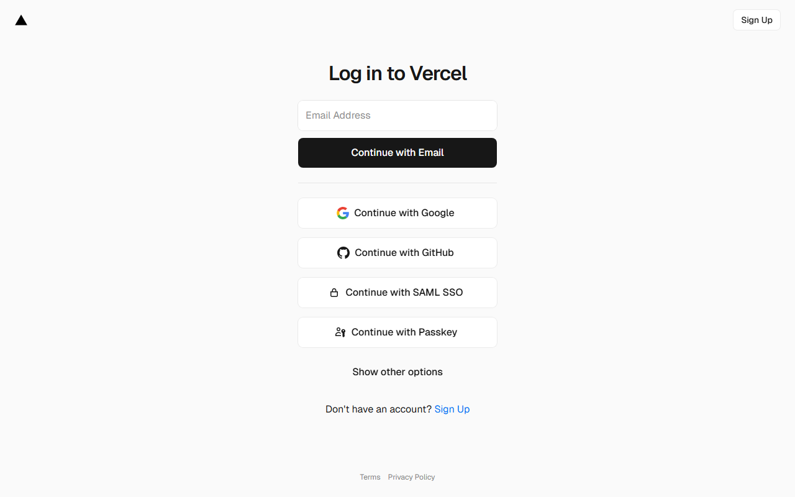

# Docker Guide

A practical guide to containerizing your application for development and production.

## Table of Contents

- [Quick Start](#quick-start)
- [Development Setup](#development-setup)
- [Production Setup](#production-setup)
- [Docker Compose](#docker-compose)
- [Common Patterns](#common-patterns)
- [Troubleshooting](#troubleshooting)

---

## Quick Start

### Prerequisites

- [Docker Desktop](https://www.docker.com/products/docker-desktop/) installed
- Docker running: `docker --version`

### Basic Commands

```bash
# Build an image
docker build -t myapp .

# Run a container
docker run -p 3000:3000 myapp

# List running containers
docker ps

# Stop a container
docker stop <container_id>

# View logs
docker logs <container_id>
```

---

## Development Setup

### Development Dockerfile

Create `Dockerfile.dev` for local development with hot reload:

```dockerfile
# Dockerfile.dev
FROM node:20-alpine

WORKDIR /app

# Install dependencies first (better caching)
COPY package*.json ./
RUN npm install

# Copy source code
COPY . .

# Expose port
EXPOSE 3000

# Start development server with hot reload
CMD ["npm", "run", "dev"]
```

### Running in Development

```bash
# Build development image
docker build -f Dockerfile.dev -t myapp-dev .

# Run with volume mount for hot reload
docker run -p 3000:3000 -v $(pwd)/src:/app/src myapp-dev
```

---

## Production Setup

### Multi-Stage Dockerfile

Create `Dockerfile` for optimized production builds:

```dockerfile
# Dockerfile
# ============================================
# Stage 1: Dependencies
# ============================================
FROM node:20-alpine AS deps
WORKDIR /app

COPY package*.json ./
RUN npm ci --only=production

# ============================================
# Stage 2: Builder
# ============================================
FROM node:20-alpine AS builder
WORKDIR /app

COPY package*.json ./
RUN npm ci

COPY . .

# Generate Prisma client (if using Prisma)
RUN npx prisma generate

# Build the application
RUN npm run build

# ============================================
# Stage 3: Runner (Production)
# ============================================
FROM node:20-alpine AS runner
WORKDIR /app

ENV NODE_ENV=production

# Create non-root user for security
RUN addgroup --system --gid 1001 nodejs
RUN adduser --system --uid 1001 nextjs

# Copy built assets
COPY --from=builder /app/public ./public
COPY --from=builder /app/.next/standalone ./
COPY --from=builder /app/.next/static ./.next/static

# Copy Prisma files (if using Prisma)
COPY --from=builder /app/node_modules/.prisma ./node_modules/.prisma
COPY --from=deps /app/node_modules ./node_modules

USER nextjs

EXPOSE 3000
ENV PORT=3000
ENV HOSTNAME="0.0.0.0"

CMD ["node", "server.js"]
```

### .dockerignore

Create `.dockerignore` to exclude unnecessary files:

```
# .dockerignore
node_modules
.next
.git
.gitignore
*.md
.env*
.vscode
coverage
.nyc_output
*.log
Dockerfile*
docker-compose*
.dockerignore
```

---

## Docker Compose

### Development Compose

Create `docker-compose.yml` for local development:

```yaml
# docker-compose.yml
version: '3.8'

services:
  # ===========================================
  # Application
  # ===========================================
  app:
    build:
      context: .
      dockerfile: Dockerfile.dev
    ports:
      - "3000:3000"
    volumes:
      - ./src:/app/src
      - ./public:/app/public
    environment:
      - DATABASE_URL=postgresql://postgres:password@db:5432/myapp_dev
      - NODE_ENV=development
    depends_on:
      - db
      - redis

  # ===========================================
  # PostgreSQL Database
  # ===========================================
  db:
    image: postgres:15-alpine
    ports:
      - "5432:5432"
    environment:
      POSTGRES_USER: postgres
      POSTGRES_PASSWORD: password
      POSTGRES_DB: myapp_dev
    volumes:
      - postgres_data:/var/lib/postgresql/data

  # ===========================================
  # Redis (for caching/sessions)
  # ===========================================
  redis:
    image: redis:7-alpine
    ports:
      - "6379:6379"
    volumes:
      - redis_data:/data

  # ===========================================
  # Adminer (Database GUI)
  # ===========================================
  adminer:
    image: adminer
    ports:
      - "8080:8080"
    depends_on:
      - db

volumes:
  postgres_data:
  redis_data:
```

### Production Compose

Create `docker-compose.prod.yml` for production:

```yaml
# docker-compose.prod.yml
version: '3.8'

services:
  app:
    build:
      context: .
      dockerfile: Dockerfile
    ports:
      - "3000:3000"
    environment:
      - NODE_ENV=production
      - DATABASE_URL=${DATABASE_URL}
      - AUTH_SECRET=${AUTH_SECRET}
    restart: unless-stopped
    healthcheck:
      test: ["CMD", "curl", "-f", "http://localhost:3000/api/health"]
      interval: 30s
      timeout: 10s
      retries: 3
```

### Common Commands

```bash
# Start all services
docker-compose up

# Start in background
docker-compose up -d

# View logs
docker-compose logs -f app

# Stop all services
docker-compose down

# Rebuild and start
docker-compose up --build

# Run one-off commands
docker-compose exec app npm run prisma:migrate
```

---

## Common Patterns

### Database with Migrations

```yaml
# docker-compose.yml
services:
  app:
    # ... other config
    command: >
      sh -c "npx prisma migrate deploy && npm run start"
```

### Environment-Specific Configs

```bash
# Development
docker-compose up

# Production
docker-compose -f docker-compose.yml -f docker-compose.prod.yml up

# Testing
docker-compose -f docker-compose.yml -f docker-compose.test.yml up
```

### Health Checks

```dockerfile
# In Dockerfile
HEALTHCHECK --interval=30s --timeout=3s --start-period=5s --retries=3 \
  CMD curl -f http://localhost:3000/api/health || exit 1
```

### Secrets Management

```yaml
# docker-compose.yml
services:
  app:
    secrets:
      - db_password
      - auth_secret
    environment:
      - DATABASE_PASSWORD_FILE=/run/secrets/db_password

secrets:
  db_password:
    file: ./secrets/db_password.txt
  auth_secret:
    file: ./secrets/auth_secret.txt
```

---

## Platform-Specific Notes

### Windows (PowerShell)

```powershell
# Volume mounts use different syntax
docker run -p 3000:3000 -v ${PWD}/src:/app/src myapp-dev

# Line endings can cause issues - ensure LF not CRLF
git config --global core.autocrlf input
```

### macOS

```bash
# For better performance, use delegated volumes
docker run -p 3000:3000 -v $(pwd)/src:/app/src:delegated myapp-dev
```

### Linux

```bash
# May need to run without sudo
sudo usermod -aG docker $USER
# Log out and back in
```

---

## Optimizations

### Layer Caching

Order your Dockerfile commands from least to most frequently changed:

```dockerfile
# 1. Base image (rarely changes)
FROM node:20-alpine

# 2. System dependencies (rarely changes)
RUN apk add --no-cache libc6-compat

# 3. Package files (changes when deps update)
COPY package*.json ./
RUN npm ci

# 4. Source code (changes frequently)
COPY . .

# 5. Build step
RUN npm run build
```

### Image Size Reduction

```dockerfile
# Use alpine images
FROM node:20-alpine  # ~180MB vs node:20 ~1GB

# Multi-stage builds
FROM node:20-alpine AS builder
# ... build steps ...

FROM node:20-alpine AS runner
# Only copy what's needed
COPY --from=builder /app/.next/standalone ./
```

### Build Arguments

```dockerfile
ARG NODE_ENV=production
ENV NODE_ENV=$NODE_ENV

# Build with different environments
docker build --build-arg NODE_ENV=staging -t myapp:staging .
```

---

## Troubleshooting

### Container won't start

```bash
# Check logs
docker logs <container_id>

# Run interactively to debug
docker run -it myapp sh
```

### Port already in use

```bash
# Find what's using the port
# Mac/Linux:
lsof -i :3000

# Windows:
netstat -ano | findstr :3000

# Kill the process or use a different port
docker run -p 3001:3000 myapp
```

### Volume permission issues

```bash
# Fix ownership (Linux/Mac)
sudo chown -R $(id -u):$(id -g) ./data

# Or run container as current user
docker run -u $(id -u):$(id -g) myapp
```

### Out of disk space

```bash
# Remove unused images
docker image prune -a

# Remove unused volumes
docker volume prune

# Full cleanup
docker system prune -a --volumes
```

### Slow builds

```bash
# Use BuildKit for faster builds
DOCKER_BUILDKIT=1 docker build -t myapp .

# Or enable in Docker Desktop settings
```

### Network issues between containers

```bash
# Containers should use service names, not localhost
# Wrong: DATABASE_URL=postgresql://localhost:5432/db
# Right: DATABASE_URL=postgresql://db:5432/db

# Check network
docker network ls
docker network inspect <network_name>
```

---

## CI/CD Integration



### GitHub Actions

```yaml
# .github/workflows/docker.yml
name: Docker Build

on:
  push:
    branches: [main]

jobs:
  build:
    runs-on: ubuntu-latest
    steps:
      - uses: actions/checkout@v4

      - name: Build Docker image
        run: docker build -t myapp:${{ github.sha }} .

      - name: Run tests in container
        run: docker run myapp:${{ github.sha }} npm test
```

### Registry Push

```bash
# Tag for registry
docker tag myapp:latest ghcr.io/username/myapp:latest

# Push to registry
docker push ghcr.io/username/myapp:latest
```

---

## Related Documentation

- [Deployment Guide](DEPLOYMENT_GUIDE.md) - Deploying containerized apps
- [Environment Management](ENVIRONMENT_MANAGEMENT.md) - Managing env vars
- [CI/CD Workflows](../../.github/workflows/README.md) - GitHub Actions setup
