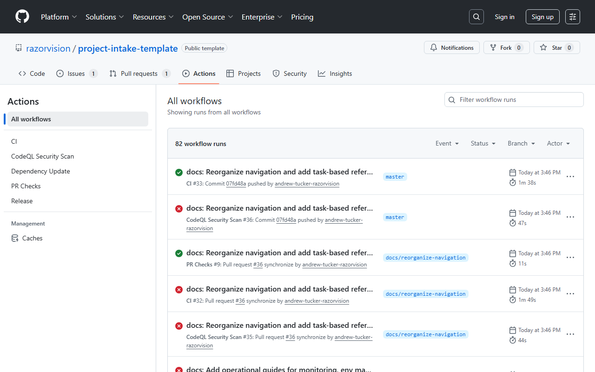

# CI Monitoring Guide

This guide covers how to monitor CI/CD pipeline status for pull requests, interpret results, and handle failures.

## Table of Contents

- [Overview](#overview)
- [Why Use the Check-Runs API](#why-use-the-check-runs-api)
- [Monitoring PR Status](#monitoring-pr-status)
- [Interpreting Check Results](#interpreting-check-results)
- [Handling Failed Checks](#handling-failed-checks)
- [Example API Calls](#example-api-calls)
- [Automation Patterns](#automation-patterns)

---

## Overview

### The Goal

After creating a PR, automatically monitor CI status and:
- Wait for all checks to complete
- Report the final status
- Identify which checks failed (if any)
- Suggest next steps

### The Challenge

GitHub has two different systems for reporting CI status:

1. **Status API** (legacy) - Simple pass/fail statuses
2. **Check Runs API** (modern) - Rich check results from GitHub Actions

Most modern CI systems (including GitHub Actions) use the Check Runs API.

---

## Why Use the Check-Runs API



### The Problem

The legacy status API (`GET /repos/{owner}/{repo}/commits/{ref}/status`) doesn't work reliably with GitHub Actions. It often returns "pending" even when all checks have completed.

### The Solution

Use the Check Runs API (`GET /repos/{owner}/{repo}/commits/{ref}/check-runs`) which:
- Works with GitHub Actions
- Provides detailed check information
- Shows individual job status
- Includes links to logs

### API Comparison

| Feature | Status API | Check Runs API |
|---------|-----------|----------------|
| GitHub Actions support | Limited | Full |
| Individual job status | No | Yes |
| Log links | No | Yes |
| Detailed output | No | Yes |
| Modern CI systems | Unreliable | Reliable |

---

## Monitoring PR Status

### The Monitoring Workflow

```
┌─────────────────────┐
│  Get PR Details     │
│  (get head SHA)     │
└──────────┬──────────┘
           │
           ▼
┌─────────────────────┐
│ Query Check Runs    │
│ for HEAD SHA        │
└──────────┬──────────┘
           │
           ▼
┌─────────────────────┐     In Progress
│ All Checks          │──────────────────┐
│ Complete?           │                  │
└──────────┬──────────┘                  │
           │                             │
           │ Yes                         │ Wait 60s
           ▼                             │
┌─────────────────────┐                  │
│ Report Results      │                  │
│ to User             │                  │
└─────────────────────┘                  │
           ▲                             │
           └─────────────────────────────┘
```

### Step 1: Get PR Details

First, get the PR's head commit SHA:

```
Use mcp__github__get_pull_request to get PR #123
```

The response includes:
```json
{
  "head": {
    "sha": "abc123..."
  }
}
```

### Step 2: Query Check Runs

Query the check runs for that SHA:

```bash
curl -s "https://api.github.com/repos/OWNER/REPO/commits/{SHA}/check-runs" \
  -H "Authorization: Bearer $GITHUB_TOKEN" \
  -H "Accept: application/vnd.github.v3+json"
```

### Step 3: Check Status

For each check run, examine:
- `status`: `queued`, `in_progress`, or `completed`
- `conclusion`: `success`, `failure`, `cancelled`, `skipped`, `neutral`, etc.

### Step 4: Wait or Report

- If any check has `status: "in_progress"` or `status: "queued"`, wait ~60 seconds and check again
- If all checks have `status: "completed"`, report the results

---

## Interpreting Check Results

### Status Values

| Status | Meaning |
|--------|--------|
| `queued` | Waiting to start |
| `in_progress` | Currently running |
| `completed` | Finished (check conclusion) |

### Conclusion Values

| Conclusion | Meaning | Action |
|------------|---------|--------|
| `success` | Check passed | Good to go |
| `failure` | Check failed | Fix required |
| `cancelled` | Check was cancelled | May need re-run |
| `skipped` | Check was skipped | Usually OK |
| `neutral` | Informational | Review if relevant |
| `timed_out` | Check exceeded time limit | May need re-run |
| `action_required` | Manual action needed | Review check details |

### Overall Status Logic

```
IF any check has conclusion = "failure"
  THEN overall = FAILED
  
ELSE IF any check has status != "completed"
  THEN overall = PENDING
  
ELSE IF all checks have conclusion = "success" or "skipped"
  THEN overall = PASSED
  
ELSE
  THEN overall = REVIEW NEEDED
```

---

## Handling Failed Checks

### When Checks Fail

1. **Identify the failure** - Which check(s) failed?
2. **Get the logs** - Use the `details_url` from the check run
3. **Diagnose the issue** - Common causes below
4. **Fix and push** - Checks will re-run automatically

### Common Failure Types

#### Lint Failures

**Symptoms:** ESLint, Prettier, or style checks fail

**Solution:**
```bash
npm run lint -- --fix
npm run format
git add -A && git commit -m "style: fix lint errors"
git push
```

#### Test Failures

**Symptoms:** Unit or integration tests fail

**Solution:**
1. Run tests locally: `npm test`
2. Fix failing tests
3. Commit and push

#### Type Errors

**Symptoms:** TypeScript compilation fails

**Solution:**
```bash
npm run typecheck
```
Fix reported errors, commit, and push.

#### Build Failures

**Symptoms:** Production build fails

**Solution:**
```bash
npm run build
```
Fix build errors, commit, and push.

#### Security Audit

**Symptoms:** npm audit finds vulnerabilities

**Solution:**
```bash
npm audit fix
# Or for breaking changes
npm audit fix --force
```

### Re-running Checks

Some checks can be re-run without new commits:

- Flaky tests
- Timeout issues
- Transient network errors

Use GitHub UI: PR page → "Re-run failed jobs" or "Re-run all jobs"

---

## Example API Calls

### Using curl

```bash
# Get check runs for a commit
curl -s "https://api.github.com/repos/OWNER/REPO/commits/{SHA}/check-runs" \
  -H "Authorization: Bearer $GITHUB_TOKEN" \
  -H "Accept: application/vnd.github.v3+json" \
  | jq '.check_runs[] | {name: .name, status: .status, conclusion: .conclusion}'
```

### Formatted Output

```bash
curl -s "https://api.github.com/repos/OWNER/REPO/commits/{SHA}/check-runs" \
  -H "Authorization: Bearer $GITHUB_TOKEN" \
  | jq -r '.check_runs[] | "\(.status) \(.conclusion // "pending") - \(.name)"'
```

**Example output:**
```
completed success - lint
completed success - test
completed failure - build
in_progress null - e2e-tests
```

### Using GitHub CLI

```bash
# List check runs
gh pr checks 123

# Watch checks until complete
gh pr checks 123 --watch
```

### Using MCP GitHub Tools

Note: `mcp__github__get_pull_request_status` uses the legacy Status API and may not work correctly with GitHub Actions. Use the curl approach above or GitHub CLI instead.

---

## Automation Patterns

### Pattern 1: Wait and Report

After creating a PR, automatically wait for checks and report:

```markdown
## After Creating PR

1. Get PR head SHA from mcp__github__get_pull_request
2. Query check runs API
3. If in progress, wait 60 seconds and check again
4. When complete, report:
   - Overall status (passed/failed)
   - Link to PR
   - List of failed checks (if any)
5. Ask if user wants to merge (if passed)
```

### Pattern 2: Proactive Monitoring

Periodically check PR status during development:

```markdown
## Periodic Check

1. Query check runs for current PR
2. If all passed: "All checks passing, ready for review"
3. If any failed: "Check X failed, would you like me to investigate?"
4. If still running: Report progress
```

### Pattern 3: Failure Investigation

When checks fail, automatically gather context:

```markdown
## On Failure

1. Identify failed check(s)
2. Get details_url for failed check
3. Fetch and summarize log output
4. Propose fix based on error type
5. Ask if user wants to apply fix
```

### Example: Complete Monitoring Script

```bash
#!/bin/bash
# monitor-pr.sh - Monitor PR checks until complete

PR_NUMBER=$1
OWNER="your-org"
REPO="your-repo"

# Get head SHA
SHA=$(gh pr view $PR_NUMBER --json headRefOid -q '.headRefOid')

while true; do
  # Get check status
  RESULT=$(curl -s "https://api.github.com/repos/$OWNER/$REPO/commits/$SHA/check-runs" \
    -H "Authorization: Bearer $GITHUB_TOKEN" \
    -H "Accept: application/vnd.github.v3+json")
  
  # Count statuses
  TOTAL=$(echo $RESULT | jq '.total_count')
  COMPLETED=$(echo $RESULT | jq '[.check_runs[] | select(.status=="completed")] | length')
  FAILED=$(echo $RESULT | jq '[.check_runs[] | select(.conclusion=="failure")] | length')
  
  echo "Checks: $COMPLETED/$TOTAL complete, $FAILED failed"
  
  if [ "$COMPLETED" -eq "$TOTAL" ]; then
    if [ "$FAILED" -gt 0 ]; then
      echo "FAILED: Some checks did not pass"
      echo $RESULT | jq -r '.check_runs[] | select(.conclusion=="failure") | .name'
    else
      echo "PASSED: All checks successful"
    fi
    break
  fi
  
  sleep 60
done
```

---

## Related Documentation

- [CLAUDE.md](../../CLAUDE.md) - Project guidelines
- [Code Quality Policy](../guides/CODE_QUALITY_POLICY.md) - Quality standards
- [Change Request Workflow](CHANGE_REQUEST_WORKFLOW.md) - Development process
- [Pre-commit Hooks](pre-commit-hooks.md) - Local validation

### External Resources

- [GitHub Check Runs API](https://docs.github.com/en/rest/checks/runs)
- [GitHub Actions Documentation](https://docs.github.com/en/actions)
- [GitHub CLI](https://cli.github.com/manual/gh_pr_checks)

---

**Last Updated:** 2024-12-08
**Maintained By:** Development Team
